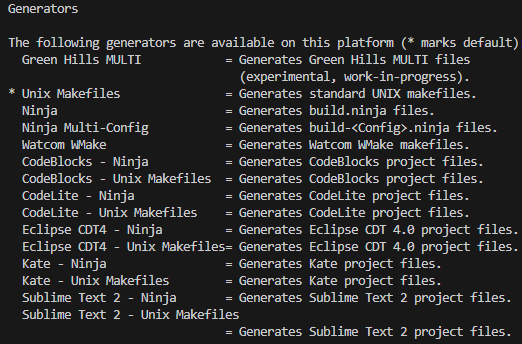

# Cmake tutorial

## Generating a project
```bash
cmake [<options>] -S <path-to-source> -B <path-to-build>
```
``` bash
mkdir build
cd build
cmake -S ... -B ... # option 1
cmake ..    # option 2 
```

Assuming that you have already built the Cmake project, you can generated project

```bash
cd build
cmake ..
```

## Generating for GCC and Clang
- -G stand for generators

List of Generators 


```bash
cd build 
cmake -S .. -B .. -G " Visual Studio 16 2019 "  # Option 1
cmake .. -G  " Visual Studio 16 2019 "  # Option 2
```

## Get the list of Generator 
```bash 
cd build
cmake --help
``` 

